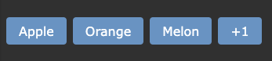

# Chip Group

## Description
A component that display a list of chips, which can be configured to show max amount of chip. It is best on where the length of chip is dynamic and has unknown or undefined maximum length.

## Dependencies 
- [ CerceisUI ] FloatPanel

## Props
- **items**: string[]: default = []: Array of strings.
- **max**: number: default = 3: Max numbers of chip display.

## Types/Interfaces
- **FilteredItems** [Interface]: The data structure after filtering max numbers of element. Consist of 2 list, displayList as list of element to display, remainingList as list of element to hide and show when needed.


## Examples
```
<c-chip-group :items="['Apple', 'Orange', 'Melon', 'Banana']">
    <template v-slot:chip="{label, remain}">
        <c-btn chip size="sm">
            {{
                label ? 
                label:
                `+${remain}`
            }}
        </c-btn>
    </template>
</c-chip-group>
```
\* Example shown in dark mode  
